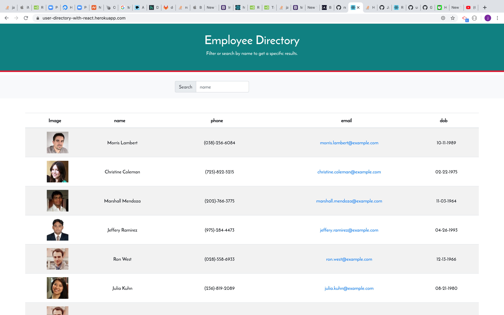

# Employment-directory

<strong>Name</strong>

This project takes the name of (Employment-directory) as it is design to view employees information.

<strong>Description </strong>

As a web developer, I want a deployed portfolio so that I can showcase my applications to potential employers and clients. It is in that spirit that my instructor gave me and other students a homework to design Employee Directory that busness or  user can use to view entire employee directory and have a quick access to their information.

<strong>Programs used</strong>

bootstrap, React, node, Git/Github and heroku for deployment. I also used randomUser API.

<strong>Installation </strong>

This is only website and does not need installation. it is currently hosted in heroku and you can access it at https://user-directory-with-react.herokuapp.com/. You can intall it as an app by clicking the + icon on the right corner of the url.

<strong>Usage</strong>

The page is simple, clean, easy to use and undertand. go to the site by using the link above. Once on the site, you will see all the employees  and the information. You can search for a specific uses/employees by entering their name on the search input. You can also filter by categories in employes's table.

<strong>Support and Contribution</strong>

If you have any question or want to see my Repo, please email me at janviermbilizi@gmail.com.

<strong>Authors and acknowledgement</strong>

As a unique Author of this project, I want to give a big thanks to my instructor and TAs who never get tired supporting or guiding me. Also thanks to my classmates who supported me directly or indirectly during this project.

<strong>Licence</strong>

Permissions of this strong copyleft license are conditioned on making available complete source code of licensed works and modifications, which include larger works using a licensed work, under the same license. Copyright and license notices must be preserved. Contributors provide an express grant of patent rights.

- Permissions Commercial use Distribution Modification Patent use Private use
- Conditions Disclose source License and copyright notice Same license State changes
- Limitations Liability Warranty
